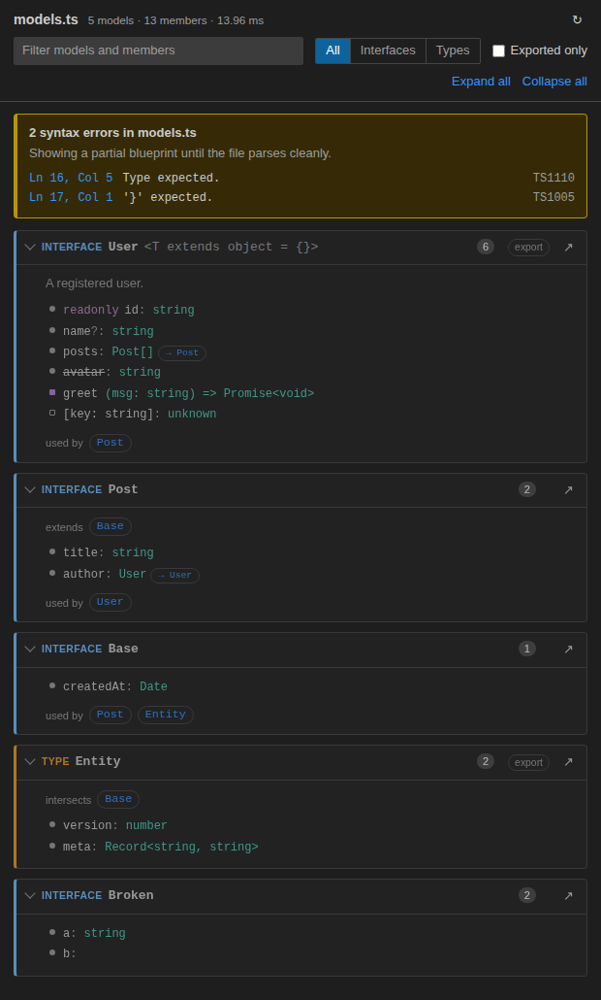

# TSBlueprint

TSBlueprint parses the TypeScript file you are editing with the TypeScript Compiler API, entirely on your machine, and shows its interfaces and object types as an interactive diagram in a sandboxed VS Code Webview.



## What it does

- Shows every `interface` and object-shaped `type` in the active `.ts` / `.tsx` file as a collapsible card.
- Updates 300 ms after you stop typing. You don't need to save.
- Lists each member's type, `readonly` / optional modifiers, JSDoc comments and `@deprecated` tags.
- Draws links between models declared in the same file: `extends`, intersections (`A & B`), property references and "used by".
- Clicking a model, member or error location jumps to that line in the editor.
- Filters by name, kind (interfaces or types) and export status.
- Keeps showing a partial diagram while the file has syntax errors, with each error listed by line and column.
- Uses your current VS Code theme, including high-contrast themes.

The diagram only includes object-shaped declarations. It skips unions, primitive aliases, mapped types and plain aliases (`type A = B`).

## Usage

1. Open a `.ts` or `.tsx` file.
2. Click the **Open Blueprint** icon in the editor title bar, or run `TSBlueprint: Open Blueprint` from the Command Palette (`Ctrl+Shift+P`).
3. Keep editing. The panel follows the active editor and switches when you open another TypeScript file.

Requires VS Code 1.90 or later.

## Architecture & Design Decisions

```
src/
├── types/ipc.ts        Message contract shared by both sides (types only, no runtime imports)
├── parser/engine.ts    AST extraction. Pure function, no vscode dependency
├── extension.ts        Extension host: panel lifecycle, debounced listeners, CSP
└── webview/
    ├── main.ts         Browser entrypoint: message handling, UI state persistence
    ├── renderer.ts     DOM rendering, filtering, collapse state
    └── styles.css      Theme-token-based styles
```

- **AST parsing, no regular expressions.** `engine.ts` builds a tree with `ts.createSourceFile` and reads declarations from it. It only walks top-level statements and namespace bodies, never function bodies or JSX. Deeper walks stay inside type annotations.
- **Each file is parsed on its own.** The parser uses an in-memory compiler host with `noResolve` and `noLib` and never reads another file from disk. Unresolved imports, path aliases and monorepo layouts can't break or slow it down.
- **Errors come back as data, not exceptions.** `parseSchema()` returns `ok | syntaxError | internalError` instead of throwing. TypeScript's parser recovers from syntax errors, so the panel shows a partial result while you type.
- **Strongly typed messages between the extension and the panel.** Both directions are discriminated unions defined in `ipc.ts`. A `MessageHandlers<T>` map type makes an unhandled message type a compile error. Messages from the Webview are checked at runtime, because the Webview is an untrusted boundary.
- **Strict Content Security Policy.** The Webview uses `default-src 'none'`. The only script allowed is the one `<script>` tag with a random nonce. Local resources are limited to `dist/`, and command URIs are turned off. The UI is built with `createElement` and `textContent` only, never `innerHTML`, so text from the source file can't inject markup.
- **Listeners are cleaned up.** The panel is a single instance. Every listener and the debounce timer are registered as a `vscode.Disposable` and released in `onDidDispose`. The debounce timer can't fire after the panel is disposed.
- **Separate Node and browser builds.** esbuild produces `dist/extension.js` (Node, CommonJS) and `dist/webview.js` (browser, IIFE). Each side has its own `tsconfig`. The Webview build fails if it imports `vscode`, `typescript` or any `node:` module.

## How to Run Locally

- Clone the repo and install dependencies:
  ```bash
  git clone <repo-url>
  cd ts-blueprint
  npm install
  ```
- Open the folder in VS Code and press **F5** ("Run Extension"). This starts the watch build and opens an **Extension Development Host** window.
- In that window, open any `.ts` file and run `TSBlueprint: Open Blueprint`.
- Edit the file. The diagram updates 300 ms after you stop typing.
- After changing the extension's own code, rebuilds happen automatically. To load them:
  - extension host code: `Ctrl+Shift+F5` (restart debugging)
  - Webview code: `Developer: Reload Webviews` in the Development Host
- To debug the Webview UI, run `Developer: Open Webview Developer Tools`.

| Command               | Purpose                                                      |
| --------------------- | ------------------------------------------------------------ |
| `npm run build`       | Development build of both bundles                            |
| `npm run watch`       | Rebuild both bundles on change                               |
| `npm run typecheck`   | Type-check extension host and Webview code                   |
| `npm test`            | Run the parser and renderer tests (vitest, happy-dom)        |
| `npm run package`     | Type-check, test, production build, then create a `.vsix`    |

## License & Privacy

Released under the [MIT License](LICENSE).

TSBlueprint does not collect, store, or transmit any personal data or source code. All Abstract Syntax Tree (AST) parsing happens locally inside the user's IDE.

The extension makes no network requests. The Webview's Content Security Policy also blocks them. See [PRIVACY.md](PRIVACY.md).
